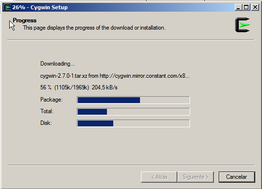

Instalar Cygwin para OpenSSH
============================

Descargar el instalador de https://cygwin.com/install.html 

.. figure:: ../images/01.png

.. figure:: ../images/04.png

.. figure:: ../images/07.png

